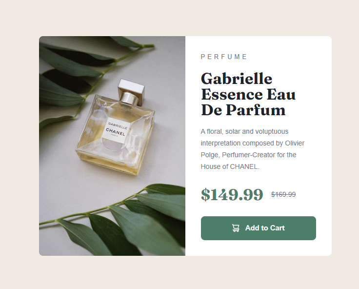

# Frontend Mentor - Product preview card component solution

This is a solution to the [Product preview card component challenge on Frontend Mentor](https://www.frontendmentor.io/challenges/product-preview-card-component-GO7UmttRfa). Frontend Mentor challenges help you improve your coding skills by building realistic projects. 

## Table of contents

- [Overview](#overview)
  - [The challenge](#the-challenge)
  - [Screenshot](#screenshot)
  - [Links](#links)
- [My process](#my-process)
  - [Built with](#built-with)
  - [What I learned](#what-i-learned)
- [Author](#author)

## Overview

### The challenge

Users should be able to:

- View the optimal layout depending on their device's screen size
- See hover and focus states for interactive elements

### Screenshot



### Links

- Solution URL: [Solution Link](https://github.com/Apeves89/product-preview-card-component-main)
- Live Site URL: [Live Site Link](https://grand-moxie-c371f8.netlify.app/)

## My process

### Built with

- Semantic HTML5 markup
- CSS custom properties
- Flexbox
- CSS Grid
- Mobile-first workflow

### What I learned

The use of CSS custom properties and the picture tag was a great takeaway for me. I look forward to using more of this in future projects to make sites more responsive. 

```html
<picture class="product__img">
  <source media="(min-width: 600px)" srcset="images/image-product-desktop.jpg">
  
</picture>
```
```css
:root{
    --clr-primary-400: hsl(158, 36%, 37%);
    --clr-primary-500: hsl(158, 36%, 20%);
    --clr-secondary-200: hsl(30, 38%, 92%);

    --clr-neutral-900: hsl(212, 21%, 14%);
    --clr-neutral-400: hsl(228, 12%, 48%);
    --clr-neutral-100: hsl(0, 0%, 100%);

    --ff-accent: 'Fraunces',serif;
    --ff-base: 'Monteserrate',sans-serif;

    --fw-regular: 500;
    --fw-bold: 700;
}
```

## Author

- Website - [Alexis Peves](https://apeves.netlify.app/)
